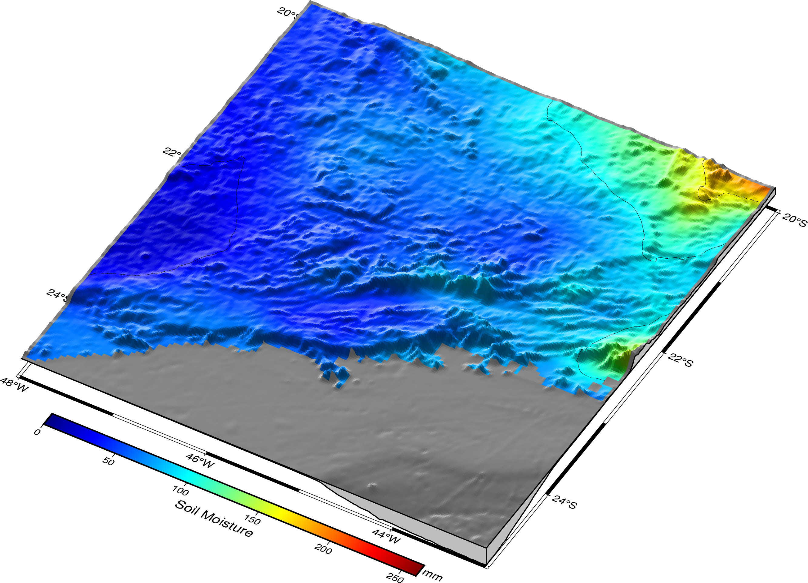

# Oficina de PyGMT

<p align="center">
  
</p>


Este é o material da Oficina INTERNA: Uma introdução à exploração de dados geoespaciais com PyGMT, ministrado pelo oceanógrafo [André Belém](https://github.com/andrebelem) para o Seminário Interdisciplinar de Sustentabilidade [SIS2024](https://www.even3.com.br/sis-2024/), mas disponibilizado aqui de forma pública para outros interessados em aprender um pouco mais sobre o PyGMT além de outras técnicas de análise de dados geoespaciais. O curso foi baseado exclusivamente no [Google COLAB](https://colab.google/) e em notebooks de Python.

Esse material foi adaptado (e traduzido) do curso ["Criando mapas bonitos com o PyGMT"](https://www.generic-mapping-tools.org/egu22pygmt/intro.html) ministrado durante o encontro da [European Geophysical Union General Assembly 2022](https://www.egu22.eu/).

**Gravação**
(em breve)

Cada tutorial é renderizado neste repositório do github para fácil visualização 👀, mas todos são Jupyter notebooks criados no COLAB projetados para serem executados interativamente. Basta seguir as instruções em cada notebook para começar a executar os tutoriais rapidamente! 🚀

Basicamente no colab, usamos duas células de código, uma para instalar o `conda colab` e outra para instalar o `pygmt`. Você pode criar essas células em qualquer colab e a partir dai começar a programar em `pygmt`.

```
!pip install -q condacolab
import condacolab
condacolab.install()
```
Espere o sistema reiniciar e depois:
```
%%capture
!mamba install pygmt #<- note que aqui usamos o mamba, mas isso pode ser feito com o conda
# esta célula não irá produzir outputs na sua tela.
```

Se você tiver alguma dúvida ou quiser fazer algum comentário aqui, use o `pull request` ou mande um email para [andrebelem@id.uff.br](mailto:andrebelem@id.uff.br).
